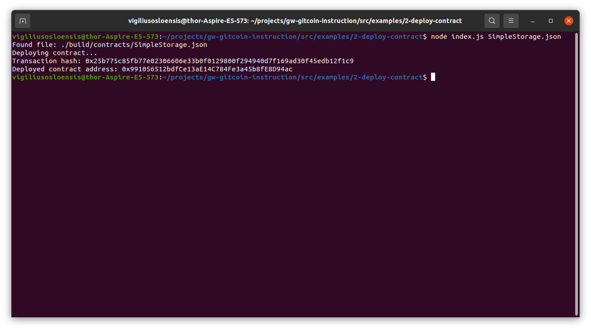

# VO-Nervos-Hackathon - Task 2
Task Submission
1. A screenshot of the console output immediately after you have successfully deployed a smart contract.

2. The transaction hash from the contract deployment (in text format).

Transaction hash: 0x7ede10e72885c4aa41eb49c86a5f0b7db91732a3d7a7f23c7aadc20e7f2638a7

3. The deployed contract address from the contract deployment (in text format).

Deployed contract address: 0x0F687347ae918E06eea247796BbBFBC7c64AFf49

In the initial submission I forgot to add 0x to the private key, but somehow it still seemed to get deployed.

Here is a screenshot after deploying with a private key prefixed with 0x.

Transaction hash: 0x25b775c85fb77e02306606e33b0f0129800f294940d7f169ad30f45edb12f1c9
Deployed contract address: 0x991056512bdfCe13aE14C784Fe3a45b8fE8D94ac
