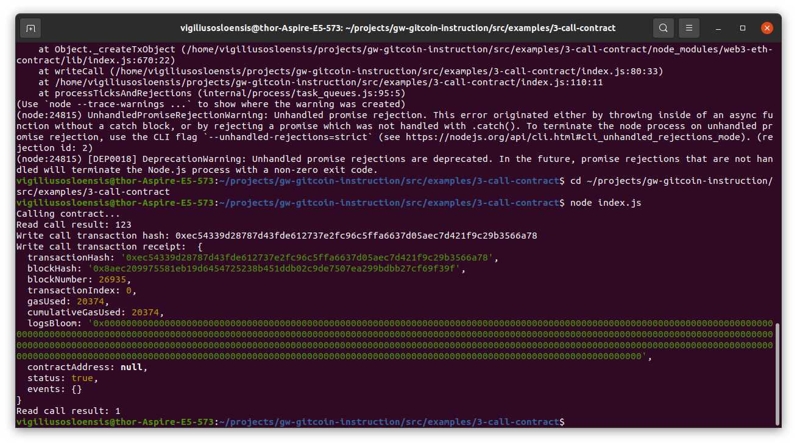

# VO-Nervos-Hackathon - Task 3
Task Submission
1. A screenshot of the console output immediately after you have successfully issued a smart contract call.

2. The transaction hash from the console output (in text format).

Write call transaction hash: 0xec54339d28787d43fde612737e2fc96c5ffa6637d05aec7d421f9c29b3566a78

3. The contract address that you called (in text format).

0x0F687347ae918E06eea247796BbBFBC7c64AFf49

4. The ABI for contract you made a call on (in text format).

<code>
const CONTRACT_ABI = [
    {
      "inputs": [],
      "stateMutability": "payable",
      "type": "constructor"
    },
    {
      "inputs": [
        {
          "internalType": "uint256",
          "name": "x",
          "type": "uint256"
        }
      ],
      "name": "set",
      "outputs": [],
      "stateMutability": "payable",
      "type": "function"
    },
    {
      "inputs": [],
      "name": "get",
      "outputs": [
        {
          "internalType": "uint256",
          "name": "",
          "type": "uint256"
        }
      ],
      "stateMutability": "view",
      "type": "function"
    }
  ]; // this should be an Array []
  </code>