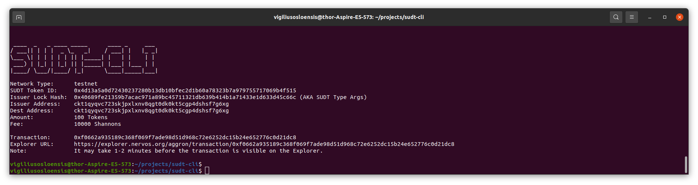
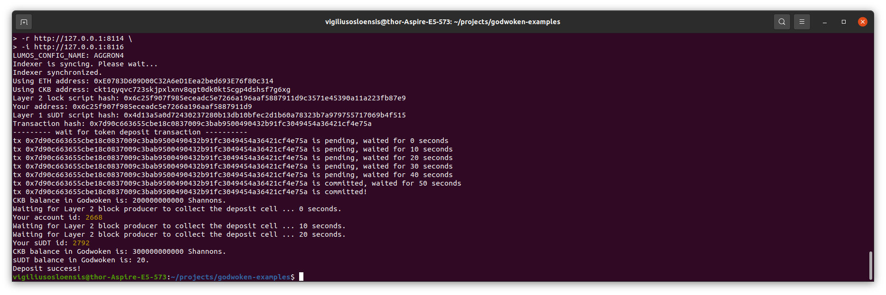

# VO-Nervos-Hackathon - Task 4
Task Submission

1. A link to the Layer 1 address you funded on the Testnet Explorer.

https://explorer.nervos.org/aggron/address/ckt1qyqvc723skjpxlxnv8qgt0dk0kt5cgp4dshsf7g6xg

2. A screenshot of the console output immediately after using sudt-cli to create your SUDT tokens on Layer 1.

3. A link to the transaction ID created by sudt-cli on the Testnet Explorer.

https://explorer.nervos.org/aggron/transaction/0xf0662a935189c368f069f7ade98d51d968c72e6252dc15b24e652776c0d21dc8

4. A screenshot of the console output immediately after you have successfully submitted a deposit to Layer 2 using the account-cli tool.

5. The SUDT ID from the console output after executing the deposit script (in text format).

Your sUDT id: 2792
