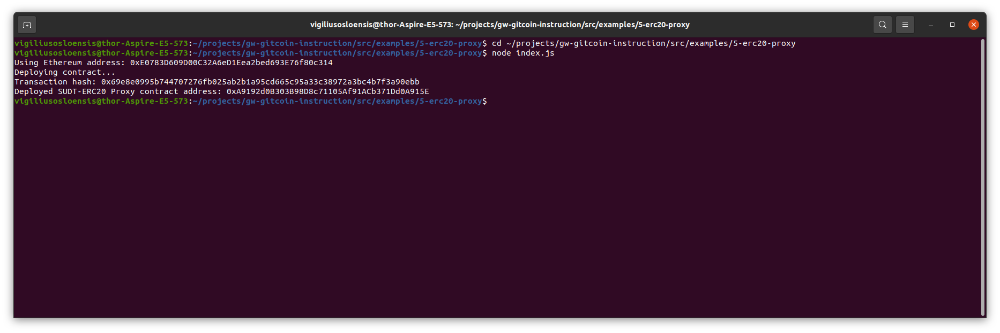
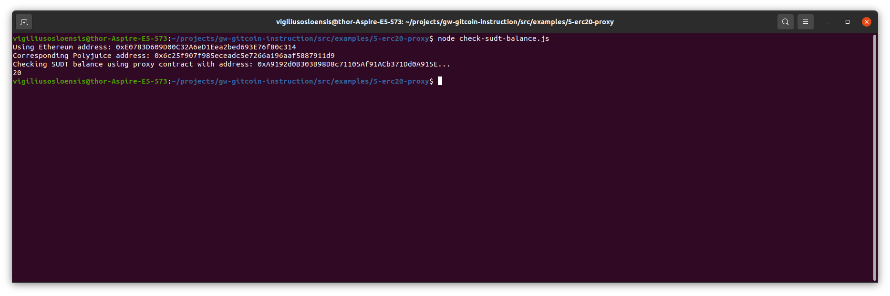

# VO-Nervos-Hackathon - Task 5
Task Submission

1. A screenshot of the console output immediately after deploying smart contract.

2. The address of the ERC20 Proxy Contract you deployed (in text format).

Deployed SUDT-ERC20 Proxy contract address: 0xA9192d0B303B98D8c71105Af91ACb371Dd0A915E

Transaction hash: 0x69e8e0995b744707276fb025ab2b1a95cd665c95a33c38972a3bc4b7f3a90ebb

3. A screenshot of the console output immediately after checking your SUDT balance.

4. The Ethereum address that was checked (in text format).

const SUDT_PROXY_CONTRACT_ADDRESS = '0xA9192d0B303B98D8c71105Af91ACb371Dd0A915E';

const ETHEREUM_ADDRESS = '0xE0783D609D00C32A6eD1Eea2bed693E76f80c314';
