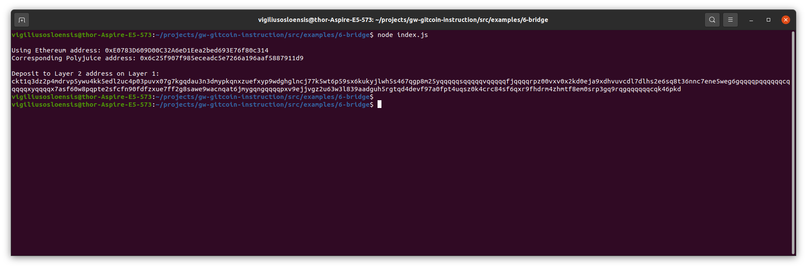

# VO-Nervos-Hackathon - Task 6
Task Submission

1. A screenshot of the console output immediately after you have successfully generated your Deposit Receiver Address.

2. Your Deposit Receiver Address (in text format).

Deposit to Layer 2 address on Layer 1: 
ckt1q3dz2p4mdrvp5ywu4kk5edl2uc4p03puvx07g7kgqdau3n3dmypkqnxzuefxyp9wdghglncj77k5wt6p59sx6kukyjlwh5s467qgp8m25yqqqqqsqqqqqvqqqqqfjqqqqrpz00vxv0x2kd0eja9xdhvuvcdl7dlhs2e6sq8t36nnc7ene5weg6gqqqqpqqqqqqcqqqqqxyqqqqx7asf60w8pqpte2sfcfn90fdfzxue7ff2g8sawe9wacnqat6jmygqngqqqqpxv9ejjvgz2u63w3l839aadguh5rgtqd4devf97a0fpt4uqsz0k4crc84sf6qxr9fhdrm4zhmtf8em0srp3gq9rqgqqqqqqcqk46pkd

3. The Ethereum address used to generate the Deposit Receiver Address (in text format).

Using Ethereum address: 0xE0783D609D00C32A6eD1Eea2bed693E76f80c314
Corresponding Polyjuice address: 0x6c25f907f985eceadc5e7266a196aaf5887911d9

4. A link to the Etherscan explorer for the successful Force Bridge transaction. This can be found on Force Bridge under History→Succeed.

https://rinkeby.etherscan.io/tx/0xe147811afca2b820c3c1e686fcd63ff2f9cb703edb88dd1f2ce51f52a1a12640

5. A link to the Nervos explorer for the successful Force bridge transaction. This can be found on Force Bridge under History→Succeed.

https://explorer.nervos.org/aggron/transaction/0xe03195b60caa5d0df684424a2910947260b331292c75a3eb4160a82bf12cc2eb